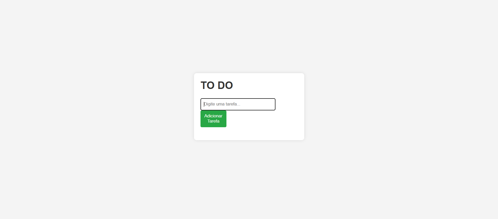
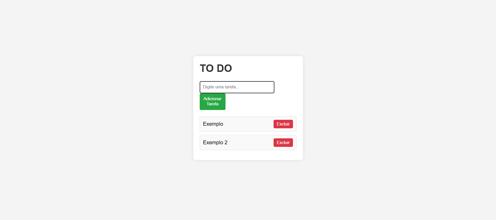

# ToDogList

Uma aplicação simples de lista de tarefas ("To-Do List") desenvolvida com HTML, CSS e JavaScript. Esta aplicação permite que os usuários adicionem, visualizem e excluam tarefas de forma intuitiva e prática.

## Funcionalidades

- Adicionar novas tarefas.
- Remover tarefas da lista.
- Interface amigável e responsiva.

## Tecnologias Utilizadas

- **HTML**: Estrutura da página.
- **CSS**: Estilização e layout.
- **JavaScript**: Lógica de adição e exclusão de tarefas.

## Capturas de Tela

### Tela Inicial

### Tarefas inseridas 

